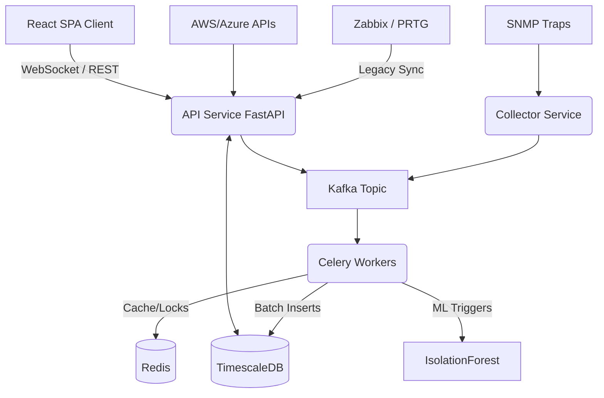

# NexusMonitor Enterprise Architecture

## Core Principles
1. **Async-First Execution**: All internal data ingestion streams across Python backend utilize `asyncio` loop handling, ensuring high throughput scaling using non-blocking I/O.
2. **Decoupled Monolithic Scale**: Monorepo split strictly between generic business libraries (`/packages`) and deployable scaling applications (`/apps`).
3. **Data Localization**: High-cardinality telemetry lands directly in `TimescaleDB` chunks natively optimized for temporal querying.

## System Topology

## Security Posture
- 100% Non-root constraints in all Dockerfile configurations.
- AES-256 for all SNMP v3 payloads.
- Role-based Access Control mapped to JWT assertions.
- Webhook HMAC SHA-256 verification.
- Vault-ready environments leveraging K8s ConfigMaps.
